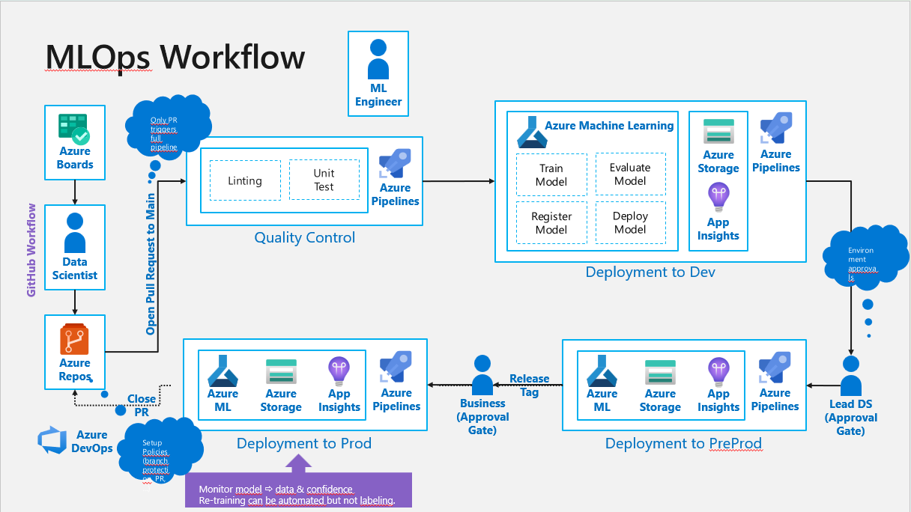

# MLOps workflow

This repository should help to get a visual overview of MLOps and is not intended to be a one-stop-shop for all MLOps implementations. It serves as demo to understand the main processes like re-training a ML model with a human in the loop.

